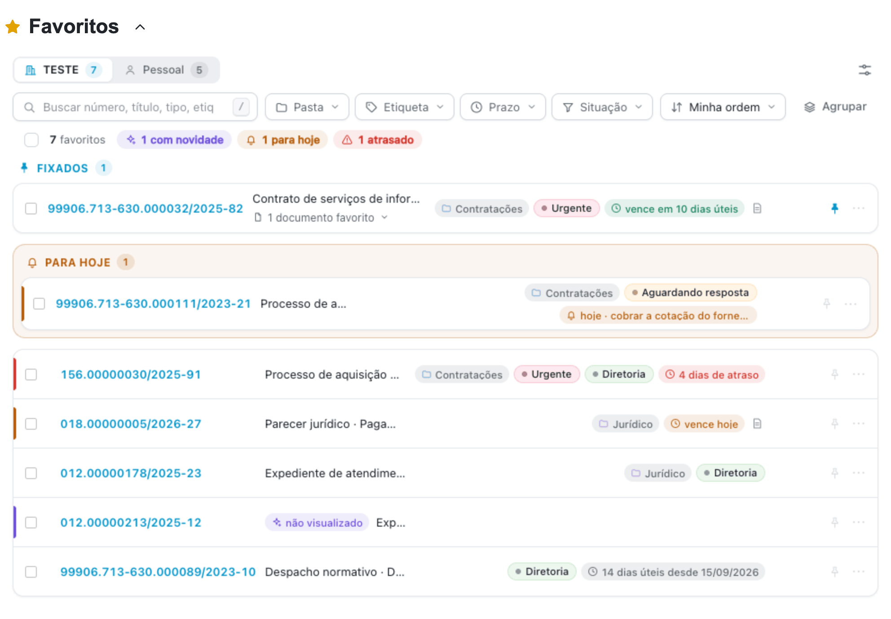
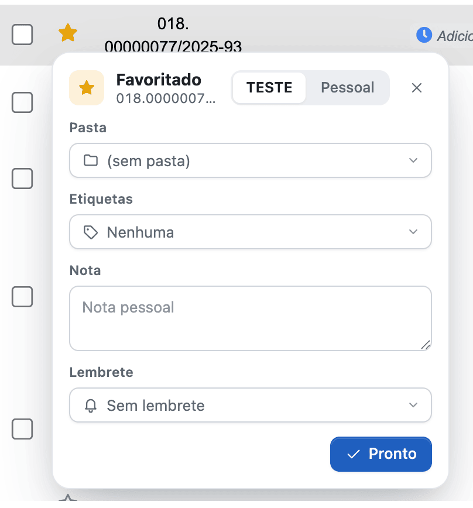
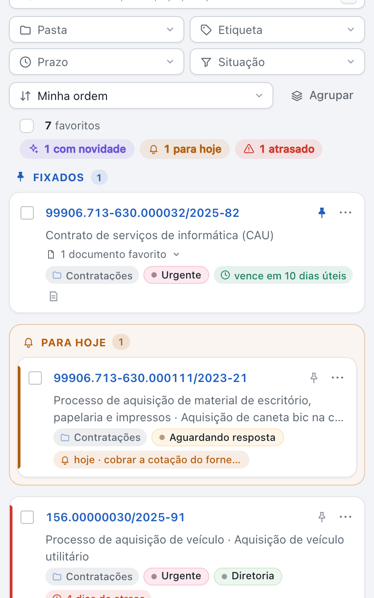
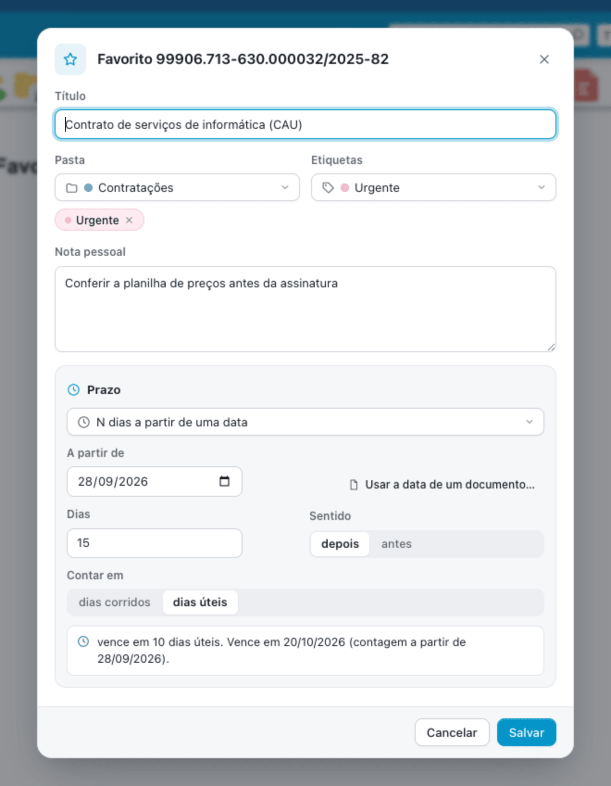
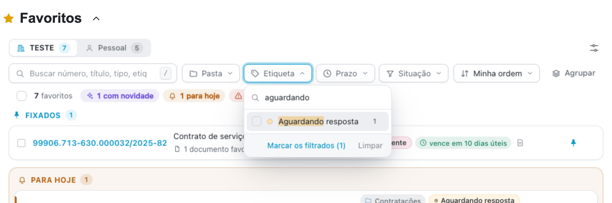
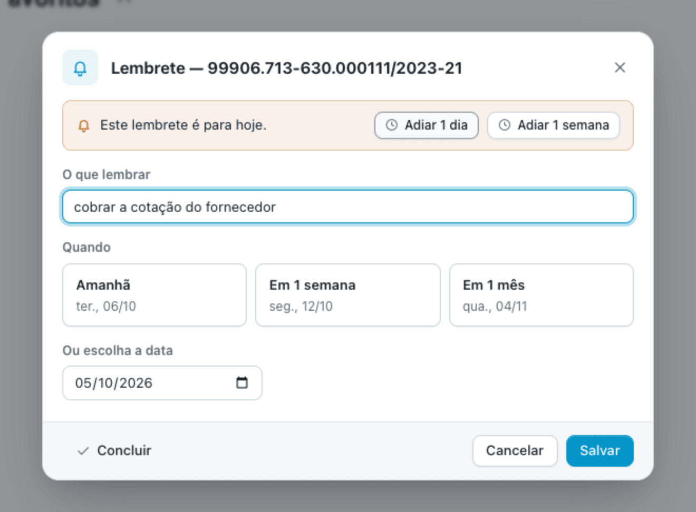
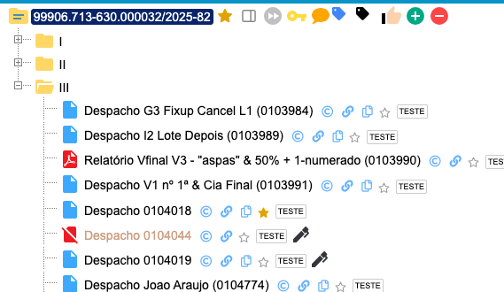
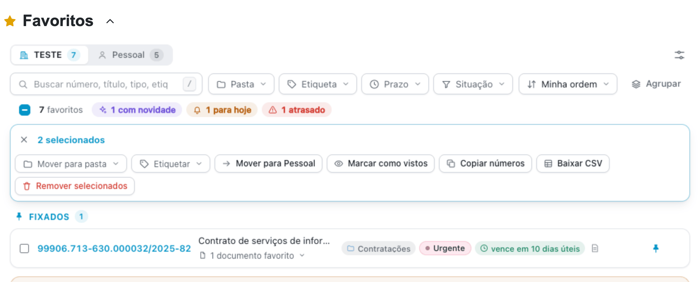
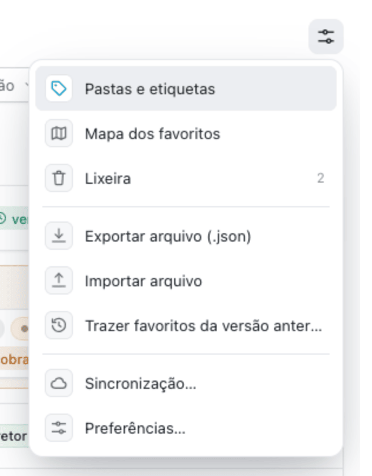
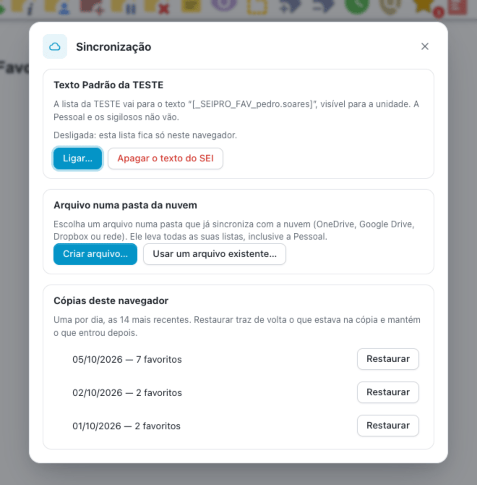

#  |  SEI Pro 

##  Gerenciar processos favoritos

Guarde os processos que você acompanha de perto, inclusive os que já saíram da sua unidade, e veja num relance **o que mudou** em cada um. Cada favorito pode ter **pasta**, **etiquetas**, **nota**, **prazo**, **lembrete**, **documentos favoritos** e **local no mapa**.

> 

Os favoritos ficam em duas listas, com a quantidade de cada uma na aba:

* **a da unidade** (no exemplo, *TESTE*): muda quando você troca de unidade no SEI;
* **a Pessoal**: aparece em todas as unidades.

### Favoritar

Clique na **estrela** ao lado do processo:

* no **Controle de Processos**, inclusive em processo ainda não visualizado (favoritar não abre o processo);
* no alto da **árvore** do processo;
* nos **blocos**, no **Acompanhamento Especial**, nos **sobrestados** e nos **resultados da Pesquisa**;
* no **Enviar Processo**, marcando **Manter processo em Favoritos**.

Ao favoritar, um balão deixa escolher na hora a pasta, as etiquetas, a nota e um lembrete, e mudar o processo para a lista **Pessoal**. Cada mudança é gravada na hora; **Pronto** fecha o balão. Para retirar o favorito, clique de novo na estrela.

> 

Se preferir favoritar sem balão, desligue **Perguntar pasta e etiquetas ao favoritar** em **Preferências…**.

### Onde a lista aparece

* **Acima da lista de processos**, antes do grupo de Controle de Processos.
* **Abaixo da lista de processos**, no Controle de Processos, como sempre. O painel segue o tema do SEI: com o modo noturno do SEI Pro ligado, ele também fica escuro.
* **No painel lateral**, ao lado de qualquer tela do SEI. Abra pelo botão ao lado da estrela, no alto da árvore, ou pelo botão **Favoritos** da barra de botões do Controle de Processos. O painel lateral acompanha o tema claro ou escuro do seu sistema e tem também as abas **Histórico** e **Agente de IA**.

> 

Escolha os locais em **Preferências…** (menu ⚙ dos favoritos) ou nas configurações do SEI Pro. As caixas **Acima da lista de processos** e **Abaixo da lista de processos** são excludentes: marcar uma desmarca a outra, e ambas podem ficar desmarcadas. **No painel lateral** é independente e pode acompanhar qualquer posição. Desmarcar todas oculta a lista fixa; o botão **Favoritos** continua permitindo abrir os favoritos.

Com o painel lateral marcado, o botão **Favoritos** da barra abre o lateral; com uma posição na página marcada, ele rola até a lista. Se nenhum local estiver marcado, o botão abre os favoritos sob demanda. O selo vermelho mostra quantos favoritos pedem atenção: lembrete vencido ou novidade.

### Organizar

Clique no título do favorito (ou em ✎) para editar:

* **Título**: um nome seu para o processo, no lugar do tipo e da especificação do SEI;
* **Pasta**: uma por favorito. Digite um nome que não existe para criar a pasta ali mesmo;
* **Etiquetas**: quantas quiser, coloridas. Também se criam digitando;
* **Nota pessoal**: só você vê;
* **Prazo**: veja abaixo.

> 

Para renomear, trocar a cor ou excluir pastas e etiquetas, use **Pastas e etiquetas** no menu ⚙. **Agrupar** mostra a lista separada por pasta, e cada pasta pode ser recolhida.

### Encontrar

* **Busca**: procura no número, no título, no tipo, na nota, nas etiquetas e no número dos documentos favoritos. Ela **não diferencia acento nem maiúscula**: *licitacao* acha *Licitação*. Aperte **/** para ir direto à busca.
* **Filtros**: **Pasta**, **Etiqueta**, **Prazo** e **Situação** (com novidade, lembrete para hoje, com nota, fora da unidade…). Cada um aceita **várias escolhas ao mesmo tempo** e tem busca própria, também sem acento. Os filtros ligados aparecem como fichas; clique na ficha para tirar o filtro.
* **Ordem**: a sua (arraste os itens), por prazo, novidades primeiro, mais recentes ou por número.

> 

Logo abaixo dos filtros, o resumo diz quantos favoritos há e quantos têm novidade, lembrete para hoje ou prazo atrasado. Clique num deles para ver só esses.

### Fixar no topo e Para hoje

* Clique no **pino** (ao lado do menu ⋯ de cada favorito) para **fixar o processo no topo** da lista. Os fixados ficam numa seção própria, acima de todos; clique de novo para desafixar.
* Os favoritos com **lembrete para hoje ou atrasado** sobem para **Para hoje**.

Uma faixa colorida à esquerda do favorito chama a atenção: vermelha para prazo atrasado, laranja para o que vence ou tem lembrete hoje, roxa para novidade.

### O que mudou

Um selo no favorito resume o que aconteceu desde a última vez que você o viu: *2 documentos novos*, *saiu da sua unidade*, *não visualizado*… O SEI Pro descobre isso **sem abrir processo nenhum por conta própria**: lê a sua caixa quando ela carrega e a árvore quando **você** abre o processo. Abrir o processo, ou escolher **Marcar como visto** no menu ⋯, apaga o selo.

Para os favoritos que estão **fora da sua unidade**, use **Atualizar fora da unidade**. Antes, o SEI Pro lê a sua caixa inteira e deixa de fora tudo o que está nela e os sigilosos. Só então consulta os demais, um de cada vez. Você pode cancelar a qualquer momento.

### Lembretes

Peça para ser lembrado **amanhã**, **em uma semana**, **em um mês** ou **numa data**, com um texto. Clique no lembrete do favorito (ou em 🔔) para mudar. No dia, o favorito aparece em **Para hoje**, e o lembrete pode ser **adiado** um dia ou uma semana, ou **concluído**.

> 

### Prazos

O prazo pode ser:

* **até uma data**;
* **N dias** (corridos ou úteis, com os feriados nacionais) **a partir de uma data**, para depois ou para antes dela;
* **a partir da assinatura de um documento** do processo (**Usar a data de um documento…**);
* **a partir do próximo documento de um tipo** (por exemplo, *Despacho*): a contagem começa quando o documento aparece;
* ou só **contar os dias** desde uma data.

O favorito mostra quanto falta ou quanto já passou, em verde (no prazo), laranja (vence hoje) ou vermelho (atrasado).

### Documentos favoritos

Na árvore do processo, cada documento ganha uma estrela pequena, ao lado dos outros ícones do SEI Pro. O documento favorito aparece dentro do favorito do processo (**1 documento favorito**); clique no número para abri-lo. Se o processo ainda não era favorito, ele entra junto.

> 

### Vários de uma vez

Marque os favoritos (ou a caixa do resumo, para todos os que estão à vista) e use a barra que aparece: **mover para uma pasta**, **etiquetar**, mover para a outra lista, **marcar como vistos**, **copiar os números**, **baixar uma planilha (CSV)** ou **remover**. O que é removido vai para a **Lixeira** e fica lá por 30 dias.

> 

### Mapa

Marque um local no favorito (menu ⋯ → **Local no mapa…**), clicando no mapa ou buscando um endereço. **Mapa dos favoritos**, no menu ⚙, mostra todos num mapa só — útil para obras, fiscalizações e vistorias.

> **De onde vem o mapa.** As imagens são as do [OpenStreetMap](https://www.openstreetmap.org), e a busca de endereços usa o serviço Nominatim, do mesmo projeto. Isso só acontece quando você abre o mapa: nesse momento o seu navegador pede as imagens da região ao OpenStreetMap e, se você pesquisar, envia o endereço digitado. **Nenhum dado do processo sai daqui** — nem o número, nem o conteúdo —, e o SEI Pro não pede a localização do seu computador.

### O menu ⚙

> 

* **Pastas e etiquetas**: renomear, trocar a cor e excluir;
* **Mapa dos favoritos**;
* **Lixeira**: os removidos nos últimos 30 dias, para restaurar;
* **Exportar arquivo (.json)** e **Importar arquivo**: importar soma à lista, não substitui;
* **Trazer favoritos da versão anterior**;
* **Sincronização…** e **Preferências…**.

### Não perder os favoritos

Os favoritos ficam guardados **na própria extensão**, e não mais no armazenamento da página do SEI: limpar o cache do navegador não os apaga. Para levá-los a outro computador, há três caminhos em **Sincronização…**:

* **Texto Padrão da unidade**, só com o seu consentimento: a lista da unidade fica num Texto Padrão chamado `[_SEIPRO_FAV_seu.login]`, que aparece em qualquer computador em que você usar o SEI Pro. Atenção: esse texto é **visível para a unidade**. A lista Pessoal e os processos sigilosos nunca vão para lá. Não use esse texto em documentos nem o edite: o SEI Pro o regrava sozinho. Dá para desligar e apagar o texto do SEI na hora;
* **Arquivo numa pasta da nuvem** (Chrome e Edge): escolha um arquivo numa pasta que já sincroniza (OneDrive, Google Drive, Dropbox ou rede). Ele leva todas as suas listas, inclusive a Pessoal;
* **Cópias deste navegador**: o SEI Pro guarda uma cópia por dia, as 14 mais recentes, e você pode restaurar qualquer uma.

> 

No Firefox, use **Exportar arquivo** e **Importar arquivo**.

### Favoritos da versão anterior

Na primeira vez, o SEI Pro oferece trazer os favoritos da versão anterior para a lista da unidade ou para a Pessoal. **Nada é apagado**: os antigos continuam guardados. Se você deixar para depois, a oferta volta mais tarde, e também dá para pedir pelo menu ⚙ → **Trazer favoritos da versão anterior**.

### Agente de IA

No painel lateral, peça ao [Agente de IA](../pages/AGENTEIA.md): *"O que mudou nos meus favoritos?"* ou *"Quais favoritos têm lembrete para hoje?"*. Ele lê a sua lista, sem os sigilosos, e não abre processo nenhum para isso.

### Como ativar

A função vem **ligada** de fábrica. Ela fica nas [Configurações do SEI Pro](../pages/DESATIVARFUNCOES.md), aba **Geral**, seção **Controle de Processos**, opção **Processos Favoritos**. Logo abaixo ficam **Onde mostrar os favoritos** e **Perguntar pasta e etiquetas ao favoritar**.

### Bom saber

* **Processo sigiloso pode ser favoritado**, mas o SEI Pro guarda só o número. Ele não vai para o Texto Padrão da unidade nem para o Agente de IA.
* Os diálogos dos favoritos abrem **no meio da parte visível da tela**, mesmo com a página rolada até o fim.
* O recurso de favoritos próprio do SEI (menu **Favoritos** do SEI) é independente deste: um não aparece no outro.

## Próximo item

> [Controle de Prazos](../pages/PRAZOS.md)
