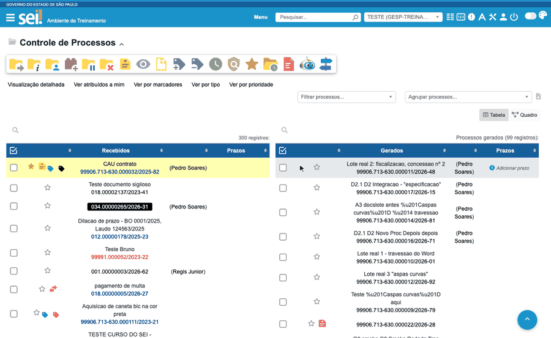
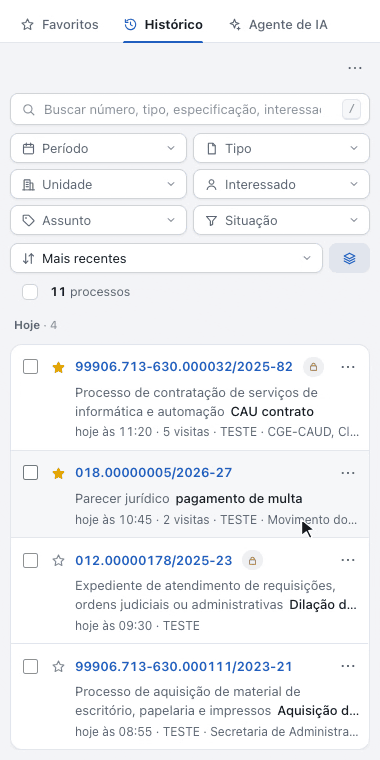

#  |  SEI Pro 

##  Histórico de processos visitados

Sabe aquele processo que você abriu ontem e não lembra o número? O SEI Pro guarda os **processos que você visitou**, com o tipo, a especificação, os interessados e quando foi o último acesso. Basta digitar um pedaço do que você lembra para achar o processo e abri-lo de novo.

> 

### Como abrir

| Onde | O que acontece |
| ---- | -------------- |
| **Menu lateral** do SEI › Histórico de Processos Visitados | Abre uma janela no meio da tela, por cima do SEI |
| **Painel lateral** do navegador › aba **Histórico** | A lista fica ao lado do SEI, junto das abas *Favoritos* e *Agente de IA* |

Na janela, o botão de painel, ao lado do **⋯**, leva a lista para o painel lateral. Com o painel aberto, cada processo que você abre no SEI aparece no topo da lista na mesma hora.

> 

### Encontrar um processo

**Busca.** Digite na caixa de busca e a lista vai filtrando enquanto você escreve. Ela procura em:

* número do processo, com ou sem pontuação. *50300.018905/2018-67*, *50300018905201867* e *018905/2018* acham o mesmo processo;
* tipo, especificação, interessados e assuntos;
* sigla da unidade onde você abriu o processo.

A busca não diferencia acento nem maiúsculas: *licitacao* acha *Licitação*. A tecla **/** leva o cursor até a busca, e **Esc** a limpa.

**Filtros.** Cada filtro abre uma lista de opções com a quantidade de processos em cada uma. Dá para marcar mais de uma.

| Filtro | Opções |
| ------ | ------ |
| **Período** | Hoje, Ontem, Últimos 7 dias, Últimos 30 dias, Mais antigos |
| **Tipo** | Os tipos de processo que você visitou |
| **Unidade** | As unidades onde você abriu cada processo |
| **Interessado** | Os interessados dos processos |
| **Assunto** | Os assuntos dos processos |
| **Situação** | Nos favoritos, Fora dos favoritos, Visitados mais de uma vez, Públicos, Restritos, Sigilosos |

Opções marcadas no mesmo filtro somam: *Tipo* "Ofício" e "Licitação" mostra os dois tipos. Filtros diferentes se combinam: *Tipo* "Ofício" com *Período* "Hoje" mostra só os ofícios de hoje. Cada filtro ligado vira uma **ficha** acima da lista. Um clique na ficha tira o filtro.

**Ordem.** *Mais recentes* (padrão), *Mais visitados* ou *Por número*. Em *Mais recentes*, o botão **Agrupar** separa a lista por dia: *Hoje*, *Ontem*, *Últimos 7 dias*, *Últimos 30 dias* e *Mais antigos*. Cada processo mostra quantas vezes você o abriu.

### Abrir o processo

Clique no número. O processo abre na mesma aba do SEI, e a janela do histórico se fecha. Para abrir **em outra aba**, use **Ctrl + clique** (**⌘ + clique** no Mac) ou o **⋯** da linha › *Abrir em outra aba*.

O **⋯** de cada linha também tem *Copiar número*, *Favoritar* e *Remover do histórico*.

### Favoritar sem sair da lista

A **estrela** de cada linha manda o processo para os [Favoritos](../pages/FAVORITOS.md), na lista da unidade em que você está. Um aviso confirma, com o botão **Desfazer**. A estrela acesa mostra os processos que já são favoritos, e o filtro *Situação* separa *Nos favoritos* e *Fora dos favoritos*.

### Vários de uma vez

Marque as caixas de seleção, ou a caixa acima da lista para marcar todos os visíveis. A barra que aparece permite:

* **Favoritar** os selecionados;
* **Copiar números**, um por linha;
* **Exportar CSV**, para abrir no Excel;
* **Remover do histórico**.

As ações valem só para os processos que estão **à vista**. Se um filtro esconder um processo marcado, ele sai da seleção.

### Privacidade

No **⋯** do topo da lista:

| Opção | O que faz |
| ----- | --------- |
| **Pausar o registro** | Nada novo entra no histórico até você clicar em *Retomar*. A lista mostra um aviso enquanto estiver pausado |
| **Apagar histórico…** | Apaga o que você viu na última hora, hoje, nos últimos 7 dias, nos últimos 30 dias ou tudo |
| **Limite de processos…** | Guarda 500, 1.000 (padrão), 2.000 ou 5.000 processos. Passou do limite, os mais antigos saem |
| **Exportar CSV** | Baixa a lista, do jeito que está filtrada |

Ao apagar por período, sai o processo inteiro se o **último acesso** a ele caiu no período. Um processo que você viu há 20 dias e de novo hoje sai em *De hoje*.

De processo **sigiloso**, o histórico guarda só o número e o tipo, sem especificação, interessados ou assuntos. As **observações** do processo nunca são guardadas.

### O Agente de IA lê o seu histórico

O [Agente de IA](../pages/AGENTEIA.md) consulta o histórico quando você pergunta sobre os processos que já viu:

* *"Que processos eu vi ontem?"*
* *"Retome o processo de licitação que abri na semana passada."*
* *"Quais processos eu mais consultei este mês?"*

Na tela Controle de Processos, a sugestão **Processos que vi esta semana** faz essa pergunta por você. Os processos sigilosos ficam de fora, e os nomes dos interessados são mascarados antes de sair do navegador.

### Como ativar

A função vem **ligada** de fábrica. Ela fica nas [Configurações do SEI Pro](../pages/DESATIVARFUNCOES.md), aba **Geral**, seção **Controle de Processos**, opção **Histórico de processos visitados**. Desligada, nada é registrado e o item some do menu. Para parar só por um tempo, use **Pausar o registro**.

### Bom saber

* **Cada pessoa tem o seu histórico.** A lista é separada por SEI e por usuário: outra pessoa que use o mesmo navegador tem a dela. Trocar de unidade não esconde nada, e a unidade vira um filtro.
* **Fica guardado na própria extensão, neste navegador.** Limpar o cache ou os dados de navegação não apaga o histórico, mas desinstalar o SEI Pro apaga. A lista não vai para outro computador, e o SEI Pro não a envia a servidor nenhum. Só o Agente de IA a consulta, e só quando você pergunta.
* **Entra quando você abre o processo.** Reabrir o mesmo processo em menos de 30 minutos não conta como nova visita. Para completar especificação, interessados e assuntos, o SEI Pro lê a tela *Consultar/Alterar Processo* no máximo uma vez a cada 12 horas por processo, e nunca em processo sigiloso.
* **O histórico da versão anterior não se perde.** Na primeira vez, os processos que você já tinha visitado são trazidos para a lista nova.

## Próximo item

> [Pesquisar link permanente](../pages/LINKPERMANENTE.md)
